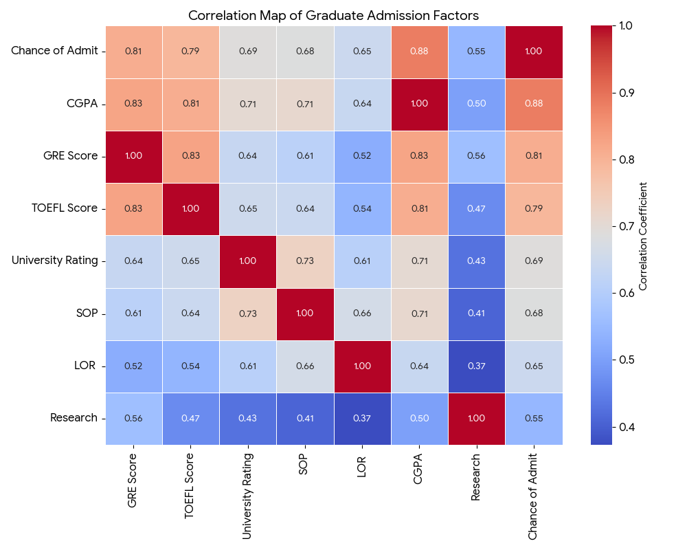

# 🎓 Graduate Admission Prediction using Machine Learning

This project predicts the **chance of a student getting admitted to a graduate program** based on various academic and personal parameters.

It applies **supervised machine learning regression models** to forecast admission chances with high accuracy.

---

## 📘 Project Overview

The goal is to predict the **probability of admission** to a graduate program based on:
- GRE Score  
- TOEFL Score  
- University Rating  
- SOP and LOR Strength  
- CGPA  
- Research Experience  

### 🧠 Workflow
1. Data Preprocessing and Cleaning  
2. Exploratory Data Analysis (EDA)  
3. Model Training & Evaluation  
4. Visualization of Key Insights  

---

## 📊 Dataset Description

| Feature | Description |
|----------|-------------|
| GRE Score | GRE Test Score (out of 340) |
| TOEFL Score | TOEFL Test Score (out of 120) |
| University Rating | Rating of the University (1–5) |
| SOP | Strength of Statement of Purpose (1–5) |
| LOR | Strength of Letter of Recommendation (1–5) |
| CGPA | Undergraduate GPA (out of 10) |
| Research | Research Experience (0 = No, 1 = Yes) |
| Chance of Admit | Target variable (0 to 1) |

---

## ⚙️ Technologies Used

- Python 🐍  
- NumPy, Pandas, Matplotlib, Seaborn  
- Scikit-learn  
- Jupyter Notebook  

---

## 📈 Visualizations

Below are some of the key insights visualized during the analysis:

### 🔥 Correlation Heatmap


---
---

### 🧮 Feature Importances


---

## 🧩 Model Performance

| Metric | Value |
|---------|--------|
| R² Score | 0.815 |
| RMSE | 1.426 |

*(Values may slightly vary depending on dataset split.)*

---

## 🚀 How to Run

1. **Clone this repository**
   ```bash
   git clone https://github.com/<your-username>/graduate-admit-prediction.git
   cd graduate-admit-prediction
